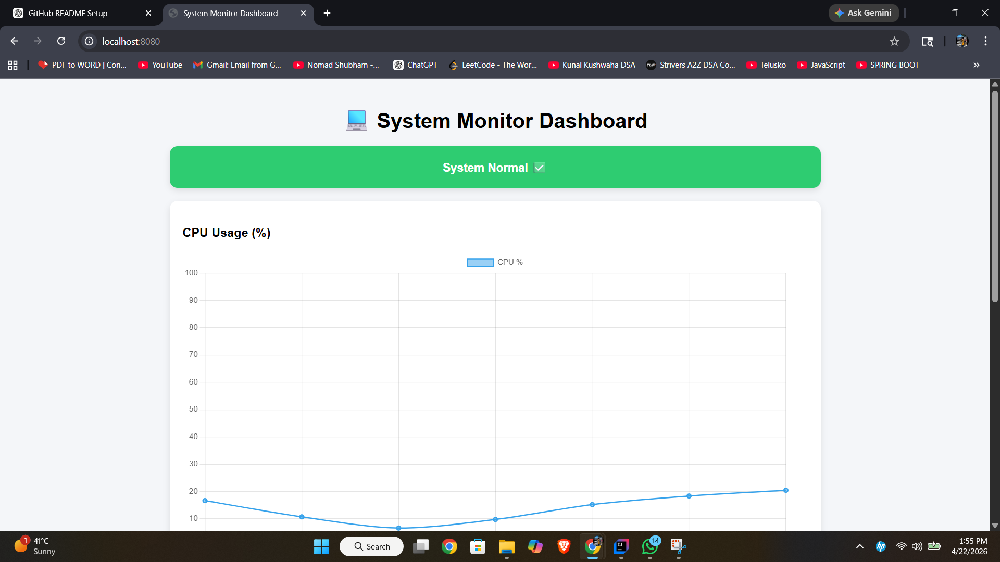

# 💻 System Monitor Dashboard

A real-time system monitoring application built using **Spring Boot** and **Chart.js** that visualizes CPU and Memory usage dynamically.

---

## 🚀 Features

- 📊 Live CPU usage monitoring
- 🧠 Real-time memory usage tracking
- 📈 Dynamic charts using Chart.js
- ⚠️ CPU alert system (high usage warning)
- 🔄 Auto-refresh every second
- 🌐 REST APIs for system metrics

---

## 🛠 Tech Stack

- Java
- Spring Boot
- OSHI (System metrics library)
- Chart.js
- HTML, CSS, JavaScript

---

## 📡 API Endpoints

- `/cpu` → Returns current CPU usage
- `/memory` → Returns current memory usage
- `/history` → (if enabled) Returns usage history

---

## 📸 Screenshot



---

## ▶️ How to Run

```bash
git clone https://github.com/your-username/system-monitor-dashboard.git
cd system-monitor-dashboard
mvn spring-boot:run